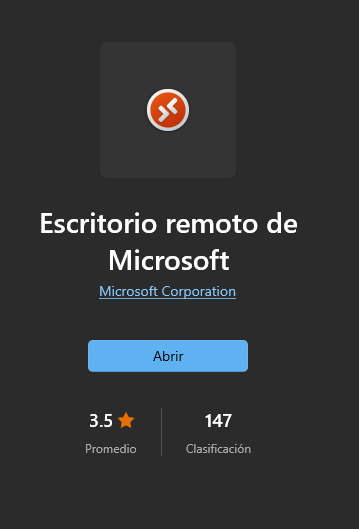
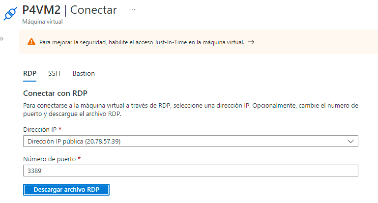
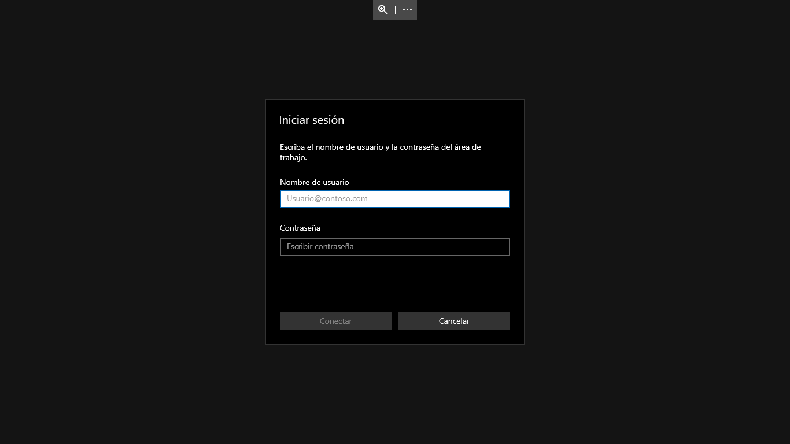

# Practica 1 Sesion 4

La práctica consiste en implementar una máquina virtual.

Instrucciones:
-
1. Ir a Virtual Machines Services y crear un grupo de recursos así como la respectiva máquina virtual.
2. Te debe generar una dirección IP.
3. Descargar la aplicación Remote Desktop en la tienda de Microsoft.

4. Iniciar y concectar la máquina virtual como RDP.
5. Descargar archivo RDP y abrirlo con la app de Remote Desktop.

6. Tendrá el acceso a su máquina virtual ingresando sus credenciales y veran la interfaz de en este caso Windows 10.

#
Autor: Rogelio Clemente Balderas
Programa Inovaccion Virtual 

Requisitos: 
-
- Cuenta y licencia Azure.
- Azure Virtual Machine Services.
- Microsoft Store Remote Desktop App.
#
